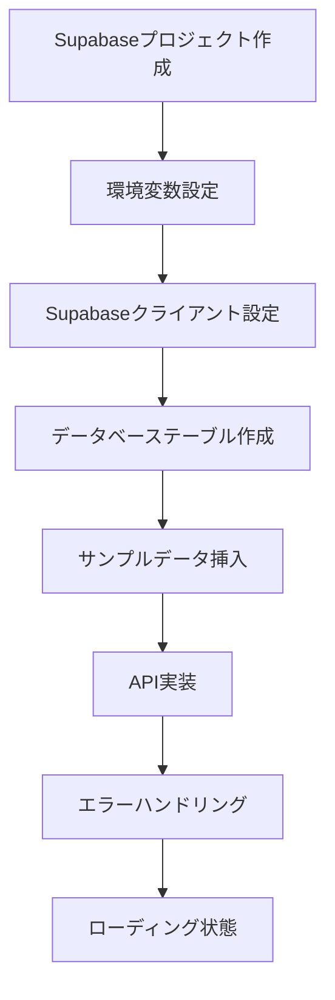

Supabase 連携実装ガイド

このドキュメントでは、静的データから Supabase データベースへの移行手順を説明します。

## 📋 実装フロー



## Step 1: Supabase プロジェクト作成

### 1.1 アカウント作成

```
1. https://supabase.com にアクセス
2. "Start your project" をクリック
3. GitHubアカウントでサインアップ
```

### 1.2 新規プロジェクト作成

```
- プロジェクト名: zimbabwe-tours
- データベースパスワード: [安全なパスワード]
- リージョン: Northeast Asia (Tokyo)
```

## Step 2: 環境変数設定

### 2.1 Supabase クライアントライブラリインストール

```bash
npm install @supabase/supabase-js
```

### 2.2 環境変数ファイル作成

```env
# .env.local
NEXT_PUBLIC_SUPABASE_URL=your_supabase_project_url
NEXT_PUBLIC_SUPABASE_ANON_KEY=your_supabase_anon_key
```

### 2.3 Supabase クライアント設定

```typescript
// lib/supabase.ts
import { createClient } from "@supabase/supabase-js";

const supabaseUrl = process.env.NEXT_PUBLIC_SUPABASE_URL!;
const supabaseAnonKey = process.env.NEXT_PUBLIC_SUPABASE_ANON_KEY!;

export const supabase = createClient(supabaseUrl, supabaseAnonKey);
```

## Step 3: データベーステーブル作成

### 3.1 tours テーブル作成

```sql
-- Supabase SQL Editorで実行
CREATE TABLE tours (
  id SERIAL PRIMARY KEY,
  title TEXT NOT NULL,
  description TEXT NOT NULL,
  duration INTEGER NOT NULL,
  type TEXT NOT NULL CHECK (type IN ('adventure', 'wildlife', 'cultural')),
  category TEXT NOT NULL,
  image TEXT NOT NULL,
  created_at TIMESTAMP WITH TIME ZONE DEFAULT timezone('utc'::text, now()) NOT NULL,
  updated_at TIMESTAMP WITH TIME ZONE DEFAULT timezone('utc'::text, now()) NOT NULL
);
```

### 3.2 サンプルデータ挿入

```sql
INSERT INTO tours (title, description, duration, type, category, image) VALUES
('Victoria Falls Adventure', 'Experience the magnificent Victoria Falls, one of the Seven Wonders of the World.', 3, 'adventure', 'natural', '/images/tours/Tour of the falls-12.jpg'),
('Hwange Safari', 'Explore Zimbabwe''s largest national park and witness incredible wildlife.', 5, 'wildlife', 'safari', '/images/tours/Game Drive-2.jpg'),
('Traditional Village Tour', 'Discover the ancient city and learn about Zimbabwe''s rich history.', 2, 'cultural', 'history', '/images/tours/Traditional Village tour-3.jpg');
```

## Step 4: 型定義更新

```typescript
// types/tour.ts
export interface Tour {
  id: number;
  title: string;
  description: string;
  duration: number;
  type: TourType;
  category: string;
  image: string;
  created_at: string;
  updated_at: string;
}

export interface DatabaseTour {
  id: number;
  title: string;
  description: string;
  duration: number;
  type: string;
  category: string;
  image: string;
  created_at: string;
  updated_at: string;
}
```

## Step 5: API 実装

### 5.1 データ取得フック作成

```typescript
// hooks/useTours.ts
import { useState, useEffect } from "react";
import { supabase } from "../lib/supabase";
import { Tour } from "../types/tour";

export const useTours = () => {
  const [tours, setTours] = useState<Tour[]>([]);
  const [loading, setLoading] = useState(true);
  const [error, setError] = useState<string | null>(null);

  const fetchTours = async () => {
    try {
      setLoading(true);
      const { data, error } = await supabase
        .from("tours")
        .select("*")
        .order("created_at", { ascending: false });

      if (error) throw error;
      setTours(data || []);
    } catch (error: any) {
      setError(error.message);
    } finally {
      setLoading(false);
    }
  };

  useEffect(() => {
    fetchTours();
  }, []);

  return { tours, loading, error, refetch: fetchTours };
};
```

### 5.2 コンポーネント更新

```typescript
// page.tsx（一部抜粋）
import { useTours } from "../hooks/useTours";

function App() {
  const { tours, loading, error } = useTours();
  const [selectedFilter, setSelectedFilter] = useState<FilterType>("all");

  if (loading) {
    return (
      <div className="App">
        <div className="loading">ツアー情報を読み込み中...</div>
      </div>
    );
  }

  if (error) {
    return (
      <div className="App">
        <div className="error">エラーが発生しました: {error}</div>
      </div>
    );
  }

  // 既存のフィルタリング・レンダリング処理
}
```

## Step 6: エラーハンドリング

### 6.1 エラー状態のスタイル追加

```css
/* App.css */
.loading,
.error {
  display: flex;
  justify-content: center;
  align-items: center;
  min-height: 400px;
  font-size: 1.2rem;
  color: #666;
}

.error {
  color: #d32f2f;
  background-color: #ffebee;
  border: 1px solid #ffcdd2;
  border-radius: 8px;
  padding: 20px;
  margin: 20px;
}

.loading {
  color: #4a9b4e;
}
```

## 🎯 学習ポイント

### 技術的な学習要素

- **非同期データ取得**: useEffect + async/await
- **状態管理**: loading, error, data の 3 状態パターン
- **型安全性**: TypeScript による API 型定義
- **カスタムフック**: ロジックの再利用と分離

### 実践的な開発スキル

- **環境変数管理**: セキュリティ考慮
- **エラーハンドリング**: ユーザビリティ向上
- **段階的移行**: レガシーコードからの安全な移行
- **デバッグ**: ブラウザ開発者ツールでの確認

## 🔍 トラブルシューティング

### よくある問題と解決法

1. **環境変数が読み込まれない**

   - `.env.local` ファイルの配置確認
   - 開発サーバーの再起動

2. **Supabase 接続エラー**

   - URL・Key の値確認
   - ネットワーク接続確認

3. **型エラー**
   - データベースと TypeScript 型定義の整合性確認

---

**Next Step**: 管理者向け CRUD 機能の実装
